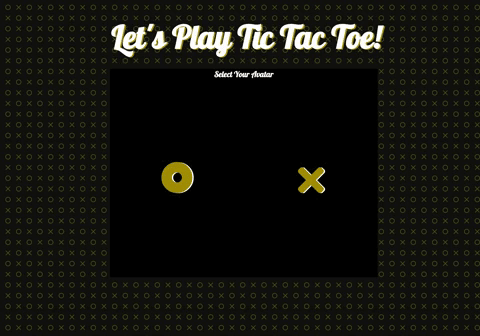

# Tic Tac Toe: Project READ ME

## Summary

Can you beat Botty, the computer? This simple tic tac toe game shows a clean UI and a smart robot to play against.

## Site Picture

## Table of Contents

- [Technologies Used](#Technologies-Used)
- [Learning Points](#Learning-Points)
- [Author](#Author)

## Technologies Used
- Javascript - used to build an interactive and dynamic game
- jQuery - used to build an interactive and dynamic game
- Classes - to create a more modularized game
- HTML and CSS - used to create a good looking game
- Git - version control system for tracking changes to code
- Github - to host the repository and deploy

## Learning Points
- Building an application without a CSS framework
- Ensuring that the computer chooses moves that ensure winning or blocking the opponent

## Author
[GitHub](https://github.com/analoo)

